2020.12.19补充第二把键盘[点击跳转](#jump)

# 零件一览_1

### PCB+灯珠+卫星轴

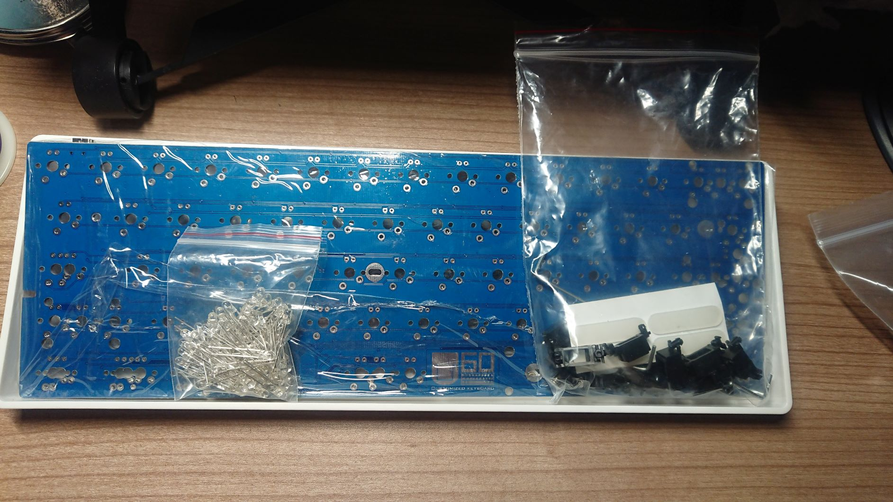

### 茶轴

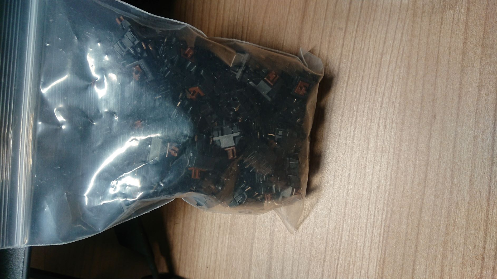

### 键帽

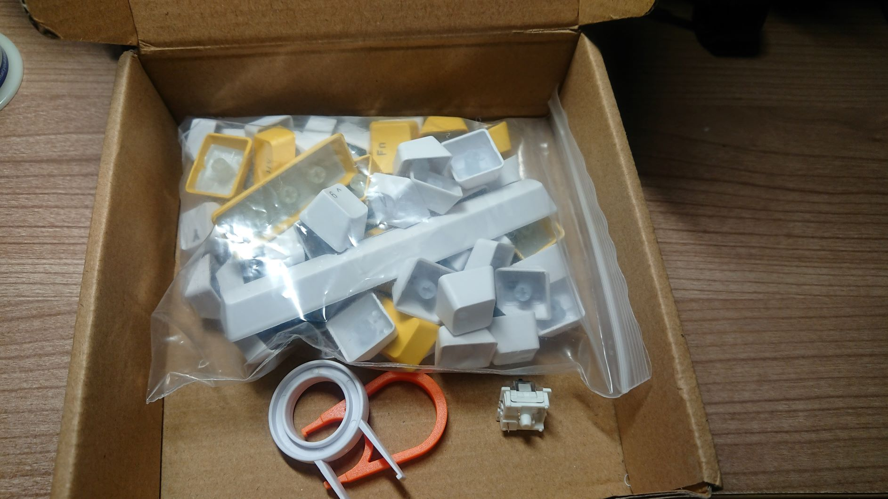

## 安装

PCB板电路测试

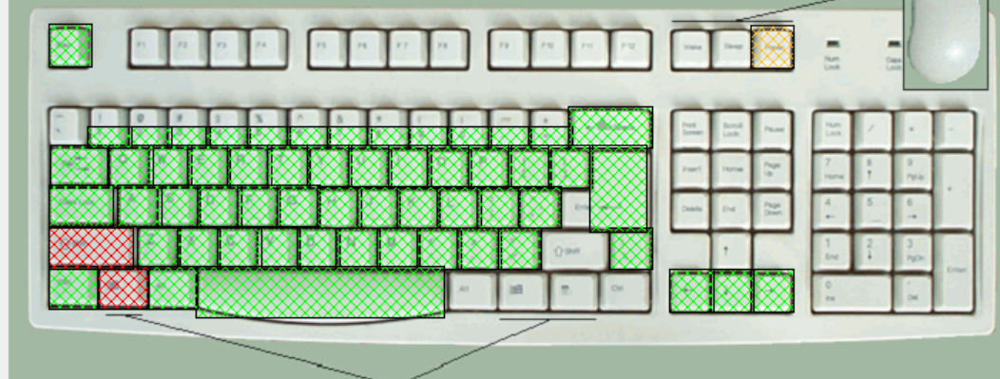

安装五角轴,上键帽,查看轴是否安装正确.焊接.

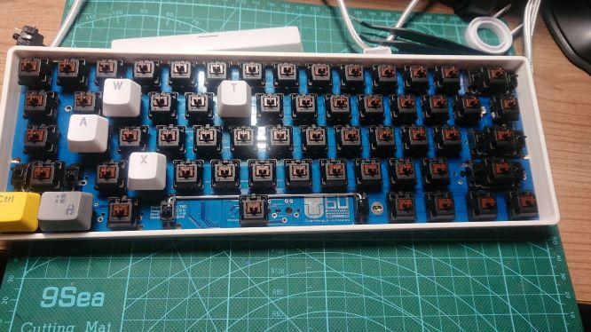

装上灯,将灯脚弯曲接触电路板,测试.这时候要注意正负极是否对应.

若灯珠都良好,焊接.

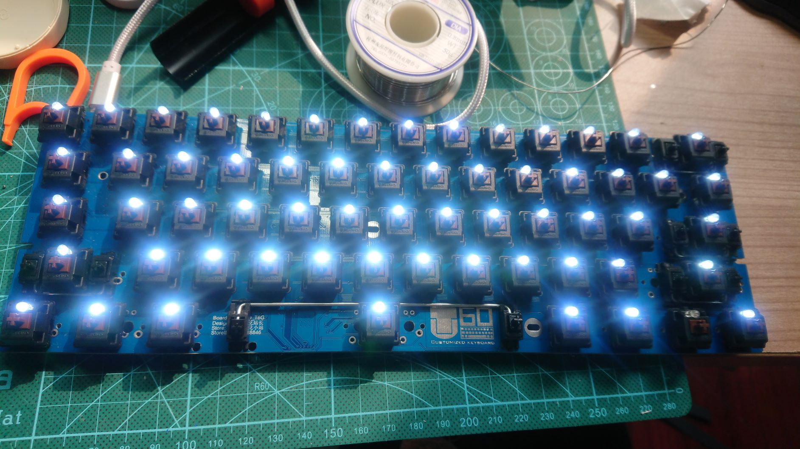

焊接完所有部件,剪去灯脚,正面与背板如图所示.

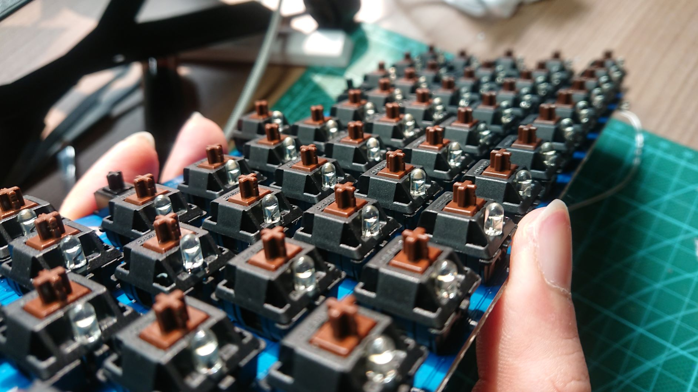

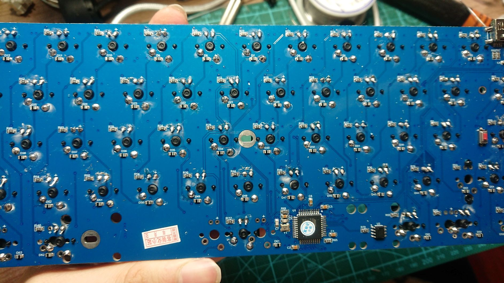

### 减震

卫星轴下方PCB粘上剪裁好的创口贴布.如果有润滑油可以把钢轴两端和卫星轴内部涂抹.

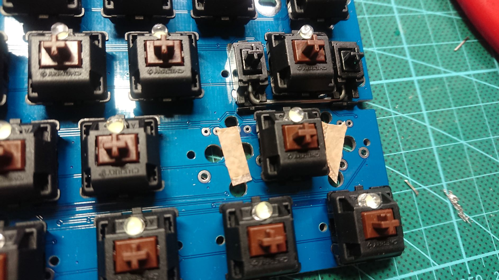

减少空腔音,装入泡沫纸.

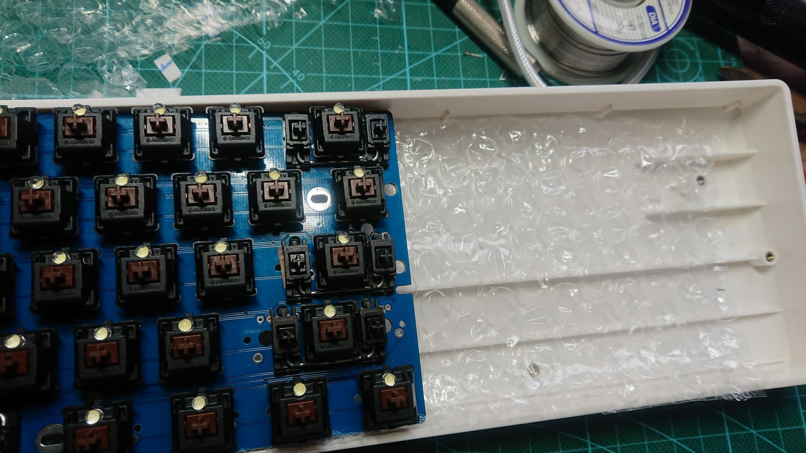

### 成品

上螺丝 装键帽.

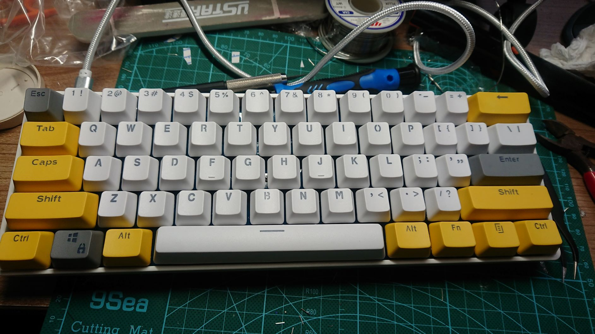

## 刷固件

参考自身的[autohotkey使用方案](http://blog.xwdidi.top/2019/10/17/2019-10-17-autohotkey/),和bgg的[仿poker3配列](../../buy_someting/gh60/3_gh60_install/[https://noodlefighter.com/post/技术笔记-GH60变身POKER3——仿poker3的TMK格式配列/).做了一定程度的调整.

1. 连接键盘,按背后的reset键
2. zadig更换键盘驱动
3. http://tkg.io/ 输入配列
4. 点击最下方烧写固件

### 配列:

第0层:

```
["Esc","!\n1","@\n2","#\n3","$\n4","%\n5","^\n6","&\n7","*\n8","(\n9",")\n0","_\n-","+\n=",{w:2},"Backspace"],
[{w:1.5},"Tab","Q","W","E","R","T","Y","U","I","O","P","{\n[","}\n]",{w:1.5},"|\n\\"],
[{w:1.75},"Fn","A","S","D","F","G","H","J","K","L",":\n;","\"\n'",{w:2.25},"Enter"],
[{w:2.25},"Shift","Z","X","C","V","B","N","M","<\n,",">\n.","?\n/",{w:2.75},"Shift"],
[{w:1.25},"Ctrl",{w:1.25},"Win",{w:1.25},"Alt",{a:7,w:6.25},"space",{a:4,w:1.25},"Fn",{w:1.25},"Alt",{w:1.25},"Menu",{w:1.25},"Ctrl"]
```

第1层:

```
["~\n`","F1","F2","F3","F4","F5","F6","F7","F8","F9","F10","F11","F12",{w:2},"Delete"],
[{a:7,w:1.5},"",{a:4},"Fn1","Fn2","Fn3","Fn4","Fn5","Home","Fn13","Back space","Fn14","End","Fn15","Fn16",{w:1.5},"Fn17"],
[{w:1.75},"Fn",{a:4},"Fn6","VolDn","VolUp","Mute","Fn7","←","↓","↑","→","Fn18","Fn19",{w:2.25},"Fn20"],
[{w:2.25},"",{a:4},"Fn8","Fn9","Fn10","Fn11","Fn12","PgUp","PgDn","","","",{w:2.75},""],
[{w:1.25},"Ctrl",{w:1.25},"Win",{w:1.25},"Alt",{a:7,w:6.25},"Fn21",{a:4,w:1.25},"Fn",{w:1.25},"caps",{w:1.25},"Menu",{w:1.25},"Ctrl"]
```

第2层:

```
[{a:7},"","","","","","","","","","","","","",{w:2},""],
[{w:1.5},"","","","","","",{a:4},"","","","","",{a:7},"","",{w:1.5},""],
[{w:1.75},"","","",{a:4},"","",{a:7},"",{a:4},"","","","","",{a:7},"",{w:2.25},""],
[{w:2.25},"","","","","","",{a:4},"","","","",{a:7},"",{a:4,w:2.75},"↑"],
[{a:7,w:1.25},"",{w:1.25},"",{w:1.25},"",{a:4,w:6.25},"",{w:1.25},"",{a:4,w:1.25},"←",{w:1.25},"↓",{w:1.25},"→"]
```

### Fn设置:

```
"0":["ACTION_LAYER_MOMENTARY",1],"1":["ACTION_MODS_KEY","LR_LEFT",["MOD_CTL","MOD_SFT"],"KC_ESCAPE"],"2":["ACTION_MODS_KEY","LR_LEFT",["MOD_CTL"],"KC_F4"],"3":["ACTION_KEY","KC_ENTER"],"4":["ACTION_MODS_KEY","LR_LEFT",["MOD_GUI"],"KC_R"],"5":["ACTION_MODS_KEY","LR_LEFT",[],"KC_GRAVE"],"6":["ACTION_KEY","KC_BSPACE"],"7":["ACTION_MODS_KEY","LR_LEFT",["MOD_SFT"],"KC_MINUS"],"8":["ACTION_MODS_KEY","LR_LEFT",["MOD_CTL","MOD_GUI"],"KC_LEFT"],"9":["ACTION_MODS_KEY","LR_LEFT",["MOD_CTL","MOD_GUI"],"KC_RIGHT"],"10":["ACTION_BACKLIGHT_DECREASE"],"11":["ACTION_BACKLIGHT_TOGGLE"],"12":["ACTION_BACKLIGHT_INCREASE"],"13":["ACTION_MODS_KEY","LR_LEFT",["MOD_CTL"],"KC_LEFT"],"14":["ACTION_MODS_KEY","LR_LEFT",["MOD_CTL"],"KC_RIGHT"],"15":["ACTION_NO"],"16":["ACTION_NO"],"17":["ACTION_KEY","KC_INSERT"],"18":["ACTION_KEY","KC_EQUAL"],"19":["ACTION_KEY","KC_DELETE"],"20":["ACTION_NO"],"21":["ACTION_LAYER_TOGGLE","2"]
```

### LED设置:

无指示灯,全背光

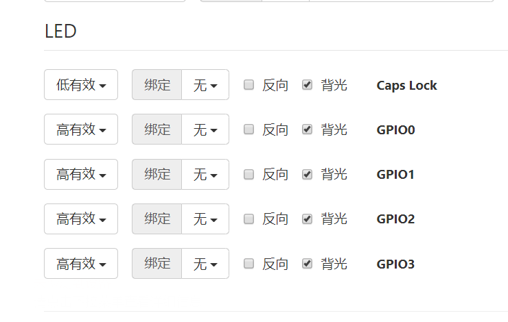

查看按键作用请使用对照查看:

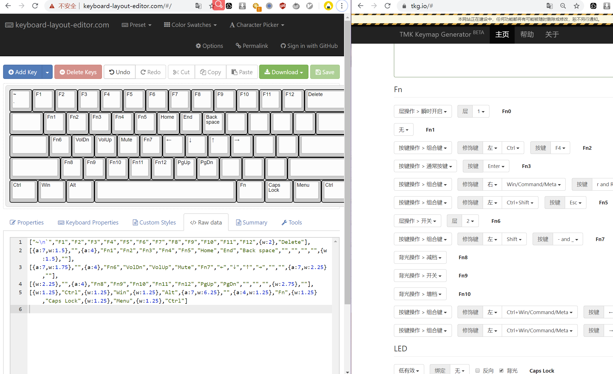

### 工具:

[http://www.keyboard-layout-editor.com](http://www.keyboard-layout-editor.com/) 配列设计

http://tkg.io/ 烧写固件

zadig 切换键盘驱动

# <span id="jump">零件一览_2</span>
- Lotshop的PCB板子 绿色，Rev.G 120元 自带BLE蓝牙
- 电池 10元
- type-c 3元 都在lotshop一次买齐
- 键盘壳 30元 包邮
- 玻璃纤维定位板(轻)+吸音棉 50元
- 旧的akko的3087键盘,因为tab键坏了,拆了三角机械轴+卫星轴+三个Led灯

共计:　213元+旧键盘

## 安装与固件
安装PCB+吸音棉+定位板放好,插入轴,然后测试每个键位的是否正常工作.
Esc有个rgb灯,要用RGB机械轴.我直接焊掉了,然后在1,2,3的位置拆入旧键盘的led灯.
焊接就行

店家文档齐全,直接看wiki就好.https://wiki.lotlab.org/ble/lot60-ble.html
因为之前用的tmk,直接下载epp文件就好,然后使用lotshop的刷固件网页读取,删掉led调节就行.

自用配置:
json文件
```json
{"Data":{"Keys":[[[41,30,31,32,33,34,35,36,37,38,39,45,46,42],[43,20,26,8,21,23,28,24,12,18,19,47,48,49],[41457,4,22,7,9,10,11,13,14,15,51,52,0,40],[225,0,29,27,6,25,5,17,16,54,55,56,0,225],[224,227,226,0,0,44,0,0,0,0,41457,226,101,224]],[[53,58,59,60,61,62,63,64,65,66,67,68,69,76],[0,809,317,40,2069,53,74,336,42,335,77,1,1,73],[41457,42,170,169,168,557,80,81,82,79,46,76,0,57],[1,0,2384,2383,1,1,1,75,78,1,1,1,0,1],[224,227,226,0,0,35332,0,0,0,0,41457,0,101,224]],[[1,1,1,1,1,1,1,1,1,1,1,1,1,1],[1,1,1,1,1,1,1,1,1,1,1,1,1,1],[1,1,1,1,1,1,1,1,1,1,1,1,0,1],[61440,0,1,1,1,1,1,1,1,1,1,1,0,82],[1,1,1,0,0,1,0,0,0,0,1,80,81,79]],[[0,0,0,0,0,0,0,0,0,0,0,0,0,0],[0,0,0,0,0,0,0,0,0,0,0,0,0,0],[0,0,0,0,0,0,0,0,0,0,0,0,0,0],[0,0,0,0,0,0,0,0,0,0,0,0,0,0],[0,0,0,0,0,0,0,0,0,0,0,0,0,0]],[[0,0,0,0,0,0,0,0,0,0,0,0,0,0],[0,0,0,0,0,0,0,0,0,0,0,0,0,0],[0,0,0,0,0,0,0,0,0,0,0,0,0,0],[0,0,0,0,0,0,0,0,0,0,0,0,0,0],[0,0,0,0,0,0,0,0,0,0,0,0,0,0]],[[0,0,0,0,0,0,0,0,0,0,0,0,0,0],[0,0,0,0,0,0,0,0,0,0,0,0,0,0],[0,0,0,0,0,0,0,0,0,0,0,0,0,0],[0,0,0,0,0,0,0,0,0,0,0,0,0,0],[0,0,0,0,0,0,0,0,0,0,0,0,0,0]],[[0,0,0,0,0,0,0,0,0,0,0,0,0,0],[0,0,0,0,0,0,0,0,0,0,0,0,0,0],[0,0,0,0,0,0,0,0,0,0,0,0,0,0],[0,0,0,0,0,0,0,0,0,0,0,0,0,0],[0,0,0,0,0,0,0,0,0,0,0,0,0,0]],[[0,0,0,0,0,0,0,0,0,0,0,0,0,0],[0,0,0,0,0,0,0,0,0,0,0,0,0,0],[0,0,0,0,0,0,0,0,0,0,0,0,0,0],[0,0,0,0,0,0,0,0,0,0,0,0,0,0],[0,0,0,0,0,0,0,0,0,0,0,0,0,0]]],"Macros":[],"Settings":[{"ID":17,"Value":0},{"ID":16,"Value":0},{"ID":18,"Value":0}]},"VID":1300,"PID":276}
```

epp 文件
```epp
:020000040000FA
:1000000000000000000000000000000000000000F0
:100010000000000A26F1A129033D01150850014FF7
:10002000012D0250094F09048900F0000000000072
:1000300000000000000000000000000000000000C0
:1000400000000000000000000000000000000000B0
:100050000000000000291E1F20212223242526271E
:100060002D2E2A2B141A0815171C180C12132F30BA
:1000700031C0041607090A0B0D0E0F33340028E1B6
:10008000001D1B061905111036373800E1E0E3E2C8
:1000900000002C00000000C0E265E0353A3B3C3D2A
:1000A0003E3F4041424344454C00C1C228C3354A0B
:1000B000C42AC54D010149C02AAAA9A8C650515257
:1000C0004F2E4C00390100C7C80101014B4E010100
:1000D000010001E0E3E20000C900000000C000658B
:1000E000E001010101010101010101010101010121
:1000F00001010101010101010101010101010101F0
:100100000101010101010101010001CA0001010118
:100110000101010101010100520101010000010082
:100120000000000150514F000000000000000000DE
:1001300000000000000000000000000000000000BF
:1001400000000000000000000000000000000000AF
:10015000000000000000000000000000000000009F
:10016000000000000000000000000000000000008F
:10017000000000000000000000000000000000007F
:10018000000000000000000000000000000000006F
:10019000000000000000000000000000000000005F
:1001A000000000000000000000000000000000004F
:1001B000000000000000000000000000000000003F
:1001C000000000000000000000000000000000002F
:1001D000000000000000000000000000000000001F
:1001E000000000000000000000000000000000000F
:1001F00000000000000000000000000000000000FF
:1002000000000000000000000000000000000000EE
:1002100000000000000000000000000000000000DE
:1002200000000000000000000000000000000000CE
:1002300000000000000000000000000000000000BE
:1002400000000000000000000000000000000000AE
:10025000000000000000000000000000000000009E
:10026000000000000000000000000000000000008E
:10027000000000000000000000000000000000007E
:100280000000000000FFFFFFFFFFFFFFFFFFFFFF79
:10029000FFFFFFFFFFFFFFFFFFFFFFFFFFFFFFFF6E
:1002A000FFFFFFFFFFFFFFFFFFFFFFFFFFFFFFFF5E
:1002B000FFFFFFFFFFFFFFFFFFFFFFFFFFFFFFFF4E
:1002C000FFFFFFFFFFFFFFFFFFFFFFFFFFFFFFFF3E
:1002D000FFFFFFFFFFFFFFFFFFFFFFFFFFFFFFFF2E
:1002E000FFFFFFFFFFFFFFFFFFFFFFFFFFFFFFFF1E
:1002F000FFFFFFFFFFFFFFFFFFFFFFFFFFFFFFFF0E
:10030000FFFFFFFFFFFFFFFFFFFFFFFFFFFFFFFFFD
:10031000FFFFFFFFFFFFFFFFFFFFFFFFFFFFFFFFED
:10032000FFFFFFFFFFFFFFFFFFFFFFFFFFFFFFFFDD
:10033000FFFFFFFFFFFFFFFFFFFFFFFFFFFFFFFFCD
:10034000FFFFFFFFFFFFFFFFFFFFFFFFFFFFFFFFBD
:10035000FFFFFFFFFFFFFFFFFFFFFFFFFFFFFFFFAD
:10036000FFFFFFFFFFFFFFFFFFFFFFFFFFFFFFFF9D
:10037000FFFFFFFFFFFFFFFFFFFFFFFFFFFFFFFF8D
:10038000FFFFFFFFFFFFFFFFFFFFFFFFFFFFFFFF7D
:10039000FFFFFFFFFFFFFFFFFFFFFFFFFFFFFFFF6D
:1003A000FFFFFFFFFFFFFFFFFFFFFFFFFFFFFFFF5D
:1003B000FFFFFFFFFFFFFFFFFFFFFFFFFFFFFFFF4D
:1003C000FFFFFFFFFFFFFFFFFFFFFFFFFFFFFFFF3D
:1003D000FFFFFFFFFFFFFFFFFFFFFFFFFFFFFFFF2D
:1003E000FFFFFFFFFFFFFFFFFFFFFFFFFFFFFFFF1D
:1003F000FFFFFFFFFFFFFFFFFFFFFFFFFFFFFFFF0D
:00000001FF
```
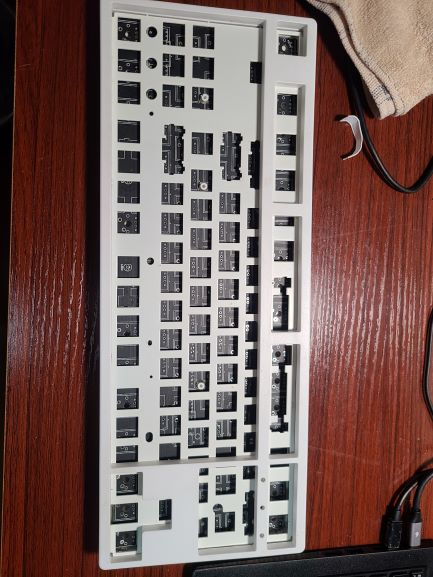
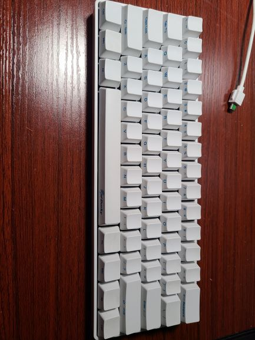