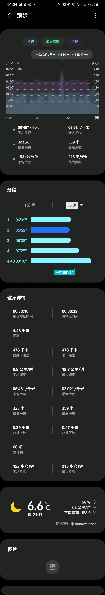

## 装备

-  129-10 = 119 [京东旗下的四件套薄绒跑步服](https://item.jd.com/100014985836.html) 
紧身裤，外套，长袖都带薄绒
- 39.9 [迪卡侬粉色腰包](https://detail.tmall.com/item.htm?spm=a1z10.3-b-s.w4011-14623109104.54.54da4488aPpiO7&id=37154225014&rn=7843d6c3a8976c87eae1cd7e8b91d902&abbucket=20#)
- 19.9 [两双中帮运动长袜](https://detail.tmall.com/item.htm?spm=a1z10.3-b-s.w4011-14623109104.72.51ab4488vb8jcW&id=43132319884&rn=69f1f0f2a6905da16fa7a2b2e3fbf93b&abbucket=20)
- 19.9 [触屏薄绒手套](https://detail.tmall.com/item.htm?spm=a1z10.5-b-s.w4011-14623109101.140.9d6c2748N0jwZJ&id=537208759849&rn=52ba77613e13dc215d6b8bd85adb3e14&abbucket=20&skuId=4401099390680)
- 14.9 [魔术头巾](https://detail.tmall.com/item.htm?spm=a1z10.3-b-s.w4011-14623109104.81.57c444881NN3ge&id=43782618632&rn=353ed953517c22bbf178c48c82dad082&abbucket=20&skuId=4476044923121)
- nike 飞马37 

说说选择上面的原因：

首先呢，性价比要高，意思就是尽可能便宜。同样的四件套迪卡侬腰300以上，京东这个100出头就买了，质量也可以接受。

因为这个衣服没有合适的口袋，而且即使有，放手机的话,跑动的时候会晃动，个人不太能接受。选择了带亮色的腰包,手机几乎没有晃动。(晚上安全点，全身黑危险。

头巾用做头部和颈部保暖，因为比较薄，即使将头巾遮到鼻梁处，换气也是能接受的。还可以冷热空气呼吸缓冲。(今天温度大概六七度的样子。

袜子的话,之前看见有14.9的五双特价运动袜,摸了下脚踝松紧带,还是买个稍微贵点的吧。

手套用作手部保暖，最便宜的手套了没得选。这个温度跑步防风保暖够用。

鞋的话，看个人了。之前发现箱根驿传的跑者几乎没人穿三大家的跑鞋都去穿nike，产生了疑问。于是去了解了下nike的科技和系列，顺便也把穿了几年的亚瑟士换掉了。

## 其他

跑步软件现在用的三星健康,手机自带。带语音提示，感觉还可以。想尝试下nike run。

我会把袜子颈部包住紧身裤，手套包住外套，头巾包住半个头部，带上外套帽子，做好防风保暖。（有机会可以买个帽子

做好热身和跑后拉伸。（推荐下滚筒，按压腿部酸爽

衣服穿的体感温度的话,微风,体表略凉,跑起来没啥感觉了。

## 题外话
外面跑的时候，看见个老哥穿了个短裤带着蓝色医用口罩跑，感觉不太合适。

## 复健记录

最后2021-01-03的第一次术后复健的的成绩如下，筋还没完全恢复，脚趾无法完全向下弯曲，有拉扯痛感，向上收缩的话，幅度没有左脚大，可以正常上翘，偶尔疼痛。慢慢来吧。

觉得自己配速其实有6，还是拉长距离慢跑做好减脂吧。