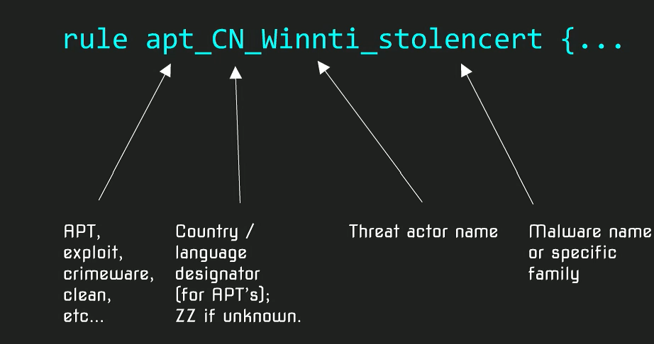

视频与字幕地址:https://bbs.pediy.com/thread-259009.htm

卡巴斯基yara笔记

yara官方文档
https://wiki.xwdidi.top/computer/security/RE/malware/YARA/creating_yara/
文件格式
https://github.com/corkami/pics
VTyara
https://support.virustotal.com/hc/en-us/articles/360000363717-VT-Hunting

meta 个人信息

strings 字符

condition yara规则判断

PE文件判断

uint16(0) = 0x5A4D 不使用($mz at 0)

详细判断条件看官方文档

yara可以做什么

主要用途根据某家族样本特征找到其新的样本,0-day,部署规则增强防御能力

pcap上使用yara

yara规则命名  

 推荐字段 

author,e-mail>,date,hash,version,

参考加拿大CCC规范,https://github.com/CybercentreCanada/CCCS-Yara

通过hash回溯样本,误报处理

好的yara规则:规则名,详细的meta描述(时间,用户,hash,描述),文档),condition标头检查,文件大小检查.

高质量检测的yara规则

减少误报:1.不要只使用api检测 2. 不要规则仅仅捕获一个样本 3.不要使用运行时的字符串 4,. 不要将所有的可能的标准作为必要条件

更好的编写yara: 1.唯一字符串或特定数据,互斥体,时间名称,user-agent,注册表键值,pdb路径,GUID,等 2.使用一组一组的数据,最好是两到三不同条件的组 3.限制文件大小减少误报  

YARA规则寻找

公开源比如florain roth的github.

APT报告

并且进行误报测试

高速运行yara

ssd多核 使用 -p参数

 

有效规则

字符串

使用PE库,对PE的各属性进行规则提取

对于office文件,可以从劫持的邮件地址入手

自动工具 YarGen 识别唯一字符串

  

比较特别的字符串 

"WinRAR\\shell\open\\command"自解压, 

"SELECT * FROM AntiVirusProduct"wmi查询语句,

"192.168"测试虚拟机,