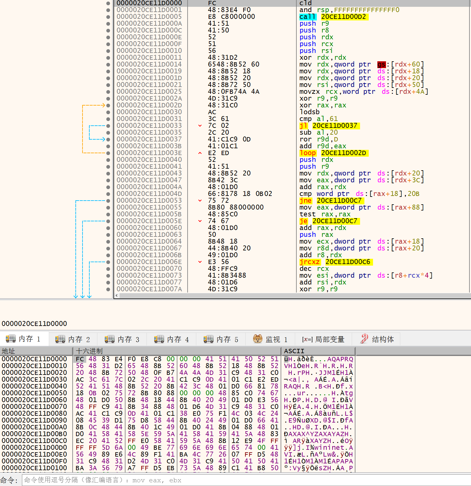

## 分析tips

### golang恢复ida符号

python2 https://github.com/0xjiayu/go_parser

python3 https://github.com/0xjiayu/go_parser/tree/py3

### shellcode开头是多个0x90
 - beacon 提取ip
 - f8运行 进入第二个call reg
 - 进入第一个call
 - 进入ret 前倒数第二个call

### 开头cld接一个call
暂时还没总结

## 红队使用工具

### DarkGld
golang打包office文件和shellcode

https://github.com/darkb1rd/DarkGld/

