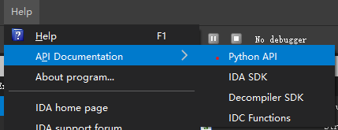

### Documentation

https://www.hex-rays.com/products/ida/support/idapython_docs/



### 字节操作
` ida_bytes.get_byte`

`ida_bytes.patch_byte`

```python
import ida_bytes

# address, size
key = ida_bytes.get_bytes(0x403070,5)

start = 0x40404c
length = 0x26f
for i in range(length):
    tmp = ida_bytes.get_byte(start+i)
    result = tmp^key[i%5]
    print(result)
    ida_bytes.patch_byte(start+i,result)
```

### 批量更改GetProcAddress获取的函数名
0. 遍历函数的调用
1. 获取传入的字符串
2. 获取写入函数地址的地址并修改
```python
import idc 
import idaapi

def change_function_name(addr,function_name):
	if idc.print_insn_mnem(addr) == "mov" and idc.print_operand(addr,1) == "eax":
		mem_addr = idc.get_operand_value(addr,0)
		new_name = "Call_" + function_name
		idc.set_name(mem_addr,new_name)
		print("Change {0} to {1}".format(str(hex(mem_addr)),new_name))

# 0x100056F0 = GetProcAddress
for xref in XrefsTo(0x100056F0,0):
	#	Data_Read(3) Data_Write(2)
	#	print(xref.type, XrefTypeName(xref.type), 'from', hex(xref.frm), 'to', hex(xref.to))
	if(xref.type == 3):
		#print(hex(xref.frm))
		argv = idaapi.get_arg_addrs(xref.frm)
		# Get Address Of String
		tmp = idc.get_operand_value(argv[1],0)
		function_name = idc.get_strlit_contents(tmp).decode("utf-8") 
		# ReName
		# 2 004 68 64 50 00 10                      push    offset aWsafdisset ; "__WSAFDIsSet"
		# .text:10001307 008 56                                  push    esi             ; hModule
		# .text:10001308 00C A3 34 57 00 10                      mov     Call___WSAFDIsSet, eax
		# .text:1000130D 00C FF 15 F0 56 00 10                   call    GetProcAddress_0
		addr = idc.prev_head(xref.frm)
		change_function_name(addr,function_name)
```