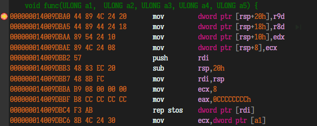

x64汇编的指针访问，是有符号的32位，上下2个G访问。

## x86

https://bbs.pediy.com/thread-224583.htm

### stdcall

### cdcel

### fastcall

## x64 

x64 只有一种调用约定`FastCall`。

**前四个参数，依次使用rcx，rdx，r8，r9寄存器进行传参。剩下的参数从右往左依次入栈，被调用者实现栈平衡，返回值存放在 RAX 中。**

但是编译器不会使用push将参数进行压栈，而是一次性使用`sub rsp，N`，开辟整个程序的栈，包括被调用者和局部变量的。然后使用`mov qword ptr[rsp+N],X`进行栈的参数传递。最后再使用`add rsp,N`恢复。

在执行Call前，栈是0x10对齐（编译器所约定的，即使对齐0x8也能执行）。针对不定参数的函数，至少会开辟4*8的栈空间。如果要使用非易变寄存器则要使用push进行保存，使用后pop返回原值。（易变寄存器 rcx,rdx,r8,r9,r10,r11。）

被调用者func内，会使用mov指令，将寄存器的值复制到栈空间中进行调用。


**不定值参数函数，最少也要分配0x20字节的栈。例printf,system;**


示例如下：开启/RTCS，和全程序优化/GL 
```C
// main.cpp
#include<cstdio>
#include<stdlib.h>
#include<Windows.h>
extern "C"{
    void asm_func();
    void func(ULONG a1,  ULONG a2, ULONG a3, ULONG a4,ULONG a5) {
        printf("a1: %p\n", a1);
        printf("a1: %p\n", a2);
        printf("a1: %p\n", a3);
        printf("a1: %p\n", a4);
    }
}
int main(int argc,char** argv) {
	asm_func();
	system("pause");
	return 0;
}
```

```c
// x64asm.asm
;大小写敏感
option casemap:none

;main Proto

func Proto
printf Proto
.data
;ttt qword ?
pStr DB 'this is in asm_func',0Ah,00h
.code

asm_func Proc
	push rdi
	sub rsp,30h
	lea rcx,[pStr]
	call printf	
	;add rsp,20h
	
	mov rdi,1
	mov rcx,rdi
	mov rcx,1
	mov rdx,2
	mov r8,3
	mov r9,4

	;sub rsp,28h
	mov qword ptr [rsp+20h],5

	call func
	;add rsp,28h
	lea rsp,qword ptr [rsp+30h]
	pop rdi
	ret
asm_func Endp

END
```

断点在call func的栈帧分析如下：
```

$ r ==>   arg1      ;a1
$ + 8     arg2      ;a2
$ + 10    arg3      ;a3
$ + 18    arg4      ;a4
$ + 20    a5 
$ + 28    padding
$ + 30    r
$ + 38    rdi
$ + 40    
$ + 48    
```