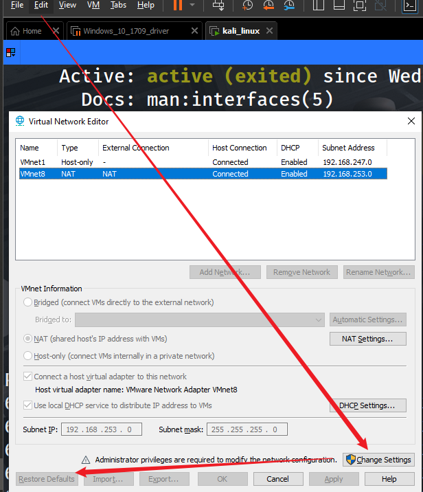

# 修复Kali突然无法解析域名的问题

1. 先将VMnet 恢复默认设置

   

2. NAT模式

3. update `/etc/network/interfaces`

   ```bash
   ┌──(koko㉿kali)-[~]
   └─$ curl baidu.com                                                                                             2 ⨯
   curl: (6) Could not resolve host: baidu.com
                                                                                                             
   ┌──(koko㉿kali)-[~]
   └─$ sudo nano /etc/network/interfaces                   
   
   ┌──(koko㉿kali)-[~]
   └─$ cat /etc/network/interfaces
   # This file describes the network interfaces available on your system
   # and how to activate them. For more information, see interfaces(5).
   
   source /etc/network/interfaces.d/*
   
   # The loopback network interface
   auto lo
   iface lo inet loopback
   
   auto eth0
   iface eth0 inet dhcp
   address 192.168.253.0 #修改成上述的subnet IP
   netmask 255.255.255.0
   gateway 192.168.253.0 #与address一致
   
   
   ┌──(koko㉿kali)-[~]
   └─$ /etc/init.d/networking restart 
   Restarting networking (via systemctl): networking.service==== AUTHENTICATING FOR org.freedesktop.systemd1.manage-units ===
   Authentication is required to restart 'networking.service'.
   Authenticating as: koko,,, (koko)
   Password: 
   ==== AUTHENTICATION COMPLETE ===
   .
                                                                                                                      
   ┌──(koko㉿kali)-[~]
   └─$ systemctl status networking.service 
   ● networking.service - Raise network interfaces
        Loaded: loaded (/lib/systemd/system/networking.service; enabled; vendor preset: enabled)
        Active: active (exited) since Wed 2022-03-16 21:54:04 EDT; 12s ago
          Docs: man:interfaces(5)
       Process: 2334 ExecStart=/sbin/ifup -a --read-environment (code=exited, status=0/SUCCESS)
      Main PID: 2334 (code=exited, status=0/SUCCESS)
         Tasks: 4 (limit: 4600)
        Memory: 1.8M
           CPU: 123ms
        CGroup: /system.slice/networking.service
                └─2365 /sbin/dhclient -4 -v -i -pf /run/dhclient.eth0.pid -lf /var/lib/dhcp/dhclient.eth0.leases -I ->
   
                                                                                                                 
   ┌──(koko㉿kali)-[~]
   └─$ ping baidu.com                                                                                           130 ⨯
   PING baidu.com (220.181.38.251) 56(84) bytes of data.
   64 bytes from 220.181.38.251 (220.181.38.251): icmp_seq=1 ttl=128 time=34.5 ms
   64 bytes from 220.181.38.251 (220.181.38.251): icmp_seq=2 ttl=128 time=35.8 ms
   64 bytes from 220.181.38.251 (220.181.38.251): icmp_seq=3 ttl=128 time=35.3 ms
   64 bytes from 220.181.38.251 (220.181.38.251): icmp_seq=4 ttl=128 time=36.1 ms
   64 bytes from 220.181.38.251 (220.181.38.251): icmp_seq=5 ttl=128 time=34.9 ms
   ^C
   --- baidu.com ping statistics ---
   5 packets transmitted, 5 received, 0% packet loss, time 4007ms
   rtt min/avg/max/mdev = 34.450/35.321/36.077/0.587 ms
   
   ```

   